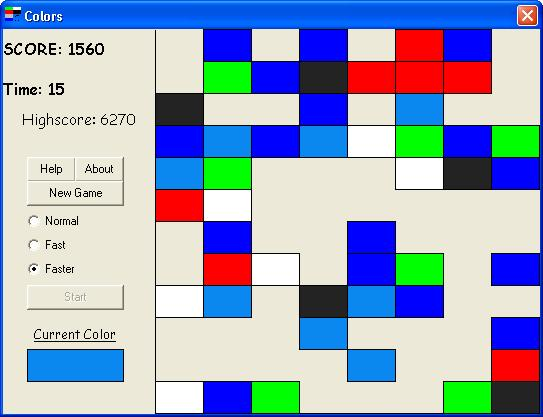

## \[Coloroids\]

### Description

An addictive game. Please vote & give feedback. New version 3.0 with sound!! Includes handy dandy all purpose sound module that all you need to do is add it to your program and change a few lines! =)
 
### More Info
 

             |
---                |---
**Submitted On**   |2002-12-03 18:45:02
**By**             |[Jason Liang](https://github.com/Planet-Source-Code/PSCIndex/blob/master/ByAuthor/jason-liang.md)
**Level**          |Beginner
**User Rating**    |4.6 (55 globes from 12 users)
**Compatibility**  |VB 3\.0, VB 4\.0 \(16\-bit\), VB 4\.0 \(32\-bit\), VB 5\.0, VB 6\.0
**Category**       |[Games](https://github.com/Planet-Source-Code/PSCIndex/blob/master/ByCategory/games__1-38.md)
**World**          |[Visual Basic](https://github.com/Planet-Source-Code/PSCIndex/blob/master/ByWorld/visual-basic.md)
**Archive File**   |[^Coloroids1507331232002\.zip](https://github.com/Planet-Source-Code/jason-liang-coloroids__1-40630/archive/master.zip)

